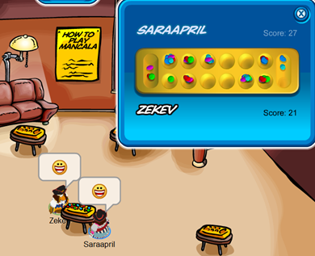

# mancala blog #1
### starting up

---------------------------------------

## my plan: 
Club Penguin is over.  
I used to spend hours on Club Penguin playing mancala so once it closed and I could never play it again, I made it my plan to recreate my childhood. For those of you who have no clue what Club Penguin or mancala is here are a few pictures. 

 
 

I will create mancala as a multiplayer game so you can play against your friends
at anytime without Club Penguin. I want to impliment a leaderboard to keep all of
the best scores. For this I will need to learn databases with ActiveRecord. I'm
still not sure if a leaderboard is the best idea for this kind of game so I might
change that in the future.

##learning:

