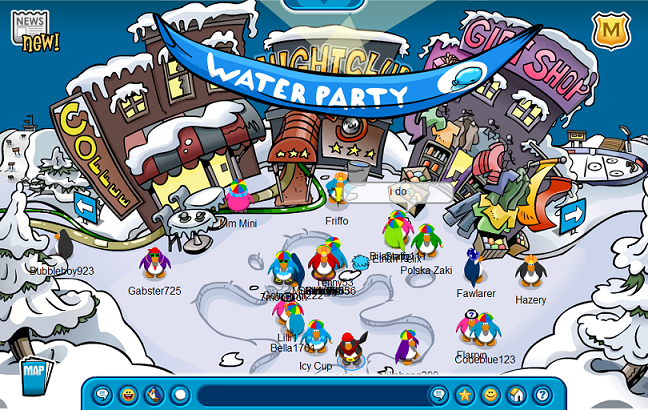

# mancala blog #1
### starting up

---------------------------------------

## my plan: 
Club Penguin is over. <br>
I used to spend hours on Club Penguin playing mancala so once it closed and I could never play it again, I made it my plan to recreate my childhood. For those of you who have no clue what Club Penguin or mancala is here are a few pictures.<br>

<br>
<br>

I will create mancala as a multiplayer game so you can play against your friends
at anytime without Club Penguin. I want to impliment a leaderboard to keep all of
the best scores. For this I will need to learn databases with ActiveRecord. I'm
still not sure if a leaderboard is the best idea for this kind of game so I might
change that in the future.

## learning?:
Instead of starting out learnning how to use ActiveRecord, I started off creating the 
game. I will make the basic outline for the game and get it functioning. This will
give me time to think about what is best for this game.

## rules:
Mancala is game with a lot of different rules so I have to make sure I understand
them all before I make the game. I quickly realized that there are so many rules
that it will actually be difficult to code because all of the logic behind the game.
I'm going to have to brush up on my JavaScript skills. 

## the game:
I quickly made a game area out of tables in HTML and numbers in different boxes 
for their value. When trying to manipulate the values of the numbers in each box
I came across a problem. I tried using JQuery since that would be easier but for
some reason it didn't work. I kept getting errors and after some Googling I realized
it was a common issue with tables and JQuery not to like eachother. I had to revert
to using regualar JS for DOM manipulation. This is an example of the code I used.
```javascript
document.getElementById("b" + num).innerHTML
```

## takeaways:
* Make sure you give yourself options.
  * You don't want to go deep into a project just to find out that you don't want
   continue it. Have other options of what you can do instead of putting all your
   effort into something you are unsure of. When deciding if I wanted to do ActiveRecord
   I didn't put all my work towards it because I was still unsure if I wanted to do it.
* Have a backup plan if something goes wrong.
  * Not having a backup plan can put you in awkward situations with nothing to do.
    Backups help us from wasting time trying to work out the problem. When Jquery
    didn't work with tables I knew I could just use plain javascript.
