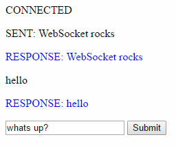

# mancala blog #4
### client / server interactions

---------------------------------------

## getting them to talk:
Last week I was able to connect to an echo server. This week I will try to get them
to send messages back and forth. I tried to use ruby on the client side but that
just made it much more confusing to make something change on the html page. After 
two days of tinkering around with ruby on the client side I finally made the change
and it made things run much more smoothly. On the server side I will still be using
Ruby. I made the websocket a variable and was able to use websocket functions on it like so.
```javascript
websocket = new WebSocket(wss://echo.websocket.org/)
websocket.onopen = function(evt) {
                
            };
websocket.onclose = function(evt) {
                
            };
websocket.onmessage = function(evt) {
                
            };
websocket.onerror = function(evt) {
               
            };
```
## NOW THEY CAN TALK:
The tutorial I followed stopped at having the having the client send text to the
server and it sending it back. Now I wanted to be able to send my own text. I included
a text box input and used the websocket functions to send it to the server. AND IT WORKED

<br>

## takeaways:
* Don't stop at tutorials
    * Exceed what the tutorial shows you. Use what it has taught you to add on 
    and create something that it didn't. This ensures that you actually learned
from the tutorial and aren't just following along.

#### sources:
https://www.tutorialspoint.com/websockets/websockets_closing_connection.htm