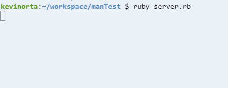

# mancala blog #7
### server problems

---------------------------------------

## server tinkering:
This week I tried to create a websockets server and connect to it. Before I was 
using echo servers that just helped me test websocket functionalities. I had been
using other peoples examples and trying to modify them to create my own server but
had no clue how to make a server. Through some tutorials I realized I needed a file
for my server usually called server.rb. This server would run seperatly from the 
app running and the app would just run seperatly but be able to connect to the same
host and socket.

## terminal troubles:
When attempting to run the server and make the client and server handshake I ran into 
a problem. No matter what I did, the c9 terminal never showed me the handshake
request like it should. Instead it remained blank like so, 
 
Mr.Mueller recommended that I try to use a school laptop with admin permissions to
try to run the server.
## mac problems:
Trying to get the mac to work was quite the challenge. When trying to install all
the gems, the mac terminal refused to install several of them. Instead I learned
that a work around was to do a sudo gem install. This worked up until I got to the
eventmachine gem. It didn't install and I found that this happened a lot on macs.
The workarounds available included changing a bunch of files that I didn't want to
mess with just in case I broke something and needed it for the future. I decided to
ditch eventmachine and go with something that could actually install which I will
get into next week.

## takeaways:
* Be prepared to fail.
    *Failure is garanteed to happen. Don't let it get to you when it does happen. 
     Keep going with what you have and make the best of it. When eventmachine didn't 
     work for me, I left it and went with other gems that are garanteed to work.